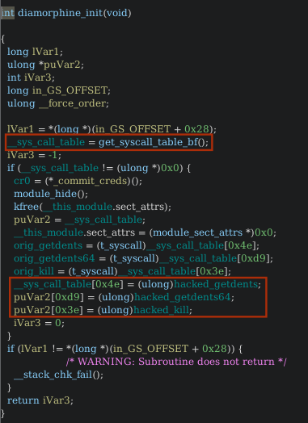

# Cyberpsychosis (reverse engineering)

## Challenge

The challenge presents a `.ko` file, which is a **kernel module**. Kernel modules are pieces of code that can be added to the kernel at runtime to provide additional functionality, such as device drivers, file systems, or other kernel features. [1]

The file is named `diamorphine.ko`, and is a **rootkit**. Rootkits are a type of malware that are designed to provide a set of functions to an attacker, while hiding their presence on the system. They are often used to maintain access to a system, or to hide other malicious software. [2,3]

As described in the challenge, our goal is to analyze the rootkit (reverse engineering) and disarm it to find the flag.

## Solution

By opening the rootkit with Ghidra, we can guess that the initialization function is `diamorphine_init`, which in the assembly code is called as `init_module`. The `init_module` function is necessary for a kernel module to "start" when it is loaded into the kernel (`insmod`). Additionally, also the `cleanup_module` function (`diamorphine_cleanup`) is needed to remove the module from the kernel (`rmmod`). [4]

The goal of the `init_module` is to retrieve the pointer to the **system call table** and replace the `sys_getdents` and `sys_kill` functions with the rootkit's own functions. 

- `sys_getdents` and `sys_getdents64` is a system call that retrieves directory entries (`linux_dirent`) from a file descriptor. [5]
- `sys_kill` is a system call that sends a signal to a process.

The function `hacked_getdents` changes the behavior of the `sys_getdents` to hide a specific folder named `psychosis`. This name can be found by analyzing the hex value of `0x69736f68637973` (in ASCII, `isohcysp`) which is in little-endian format. Slightly below there is a check for the character `s` which when joined with the previous characters, forms the word `psychosis`. 

Once found out which is the folder we want to look for, we need to understand the behavior of the `hacked_kill` function. 

We know that the `pt_regs->si` holds the signal number, the function behaves as follows:
- Signal `0x2a` (46): hide or unhide the module from the list of loaded modules (`lsmod` command).
- Signal `0x40` (64): escalate the privileges to the root user.
- Signal `0x1f` (31): hide or unhide a specific process from the list of running processes (`ps`). For example, `kill -31 <PID>` will hide the process with the given PID.

Now that we know how the rootkit behaves, we can disarm it by sending the appropriate signals to the rootkit. However, kernel modules do not have a PID, so we need to send the signals to any process by using `kill -<SIGNAL> -1`.

First we need to unhide the rootkit from the list of loaded modules: 

Then we can escalate our privileges and unload the module to make the `psychosis` folder visible:

## Sources

- [1] Kernel Modules: [https://linux-kernel-labs.github.io/refs/heads/master/labs/kernel_modules.html](https://linux-kernel-labs.github.io/refs/heads/master/labs/kernel_modules.html)
- [2] Rootkits: [https://www.malwarebytes.com/rootkit](https://www.malwarebytes.com/rootkit)
- [3] Rootkits - 2: [https://www.fortinet.com/resources/cyberglossary/rootkit](https://www.fortinet.com/resources/cyberglossary/rootkit)
- [4] Init module: [https://sysprog21.github.io/lkmpg/](https://sysprog21.github.io/lkmpg/)
- [5] sys_getdents: [https://man7.org/linux/man-pages/man2/getdents64.2.html](https://man7.org/linux/man-pages/man2/getdents64.2.html)