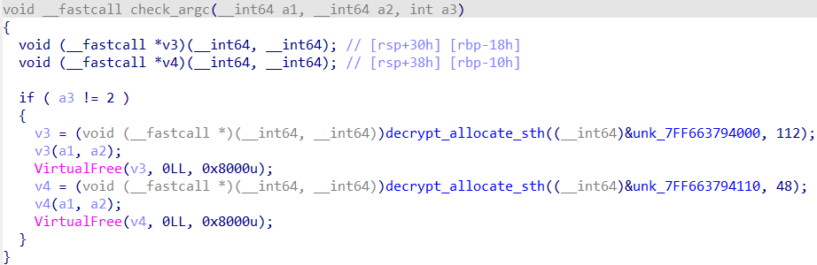
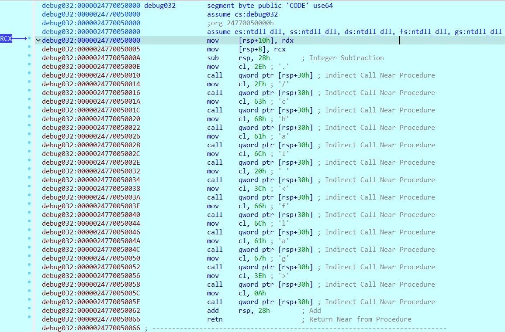

# Partial Encryption

## Introduction

The description of this challenge says: "Static-Analysis on this program didn't reveal much. There must be a better way to approach this...", but not knowing what else to do I still decided to at least give it a try. Thus, as always, I used Ghidra to look into the binary and see what I could find. This time the disassembly seems a bit strange, since it was not able to find the usual entry point of the program (like for ELF ones). This time the entry was referring function which did not seem to be the main one. In fact inside it there some functions calls such as the `sctr_initialize_crt()`, which after some research I found out that is used to initialize the C Run-time Library (CRT) which is the part of the C++ Standard Library that incorporates the ISO C99 standard library.

At this point, I was at a dead end, thus I decided to look into the HTB Forum thread of the challenge to see if there was any hint. Unluckily, the thread was quite empty, and the only hint was to use Dynamic Analysis. Now, another problem arose, how the hell do I do dynamic analysis on a Windows binary on Ubuntu? I did not want to switch to Windows, so I lost a lot of time trying out stuffs that did not work (or managed to work). Here I finally, found out that IDA has a debugger that can be used to debug Windows binaries on Linux, then why not try it out? Obviously, I could not manage to run the binary on IDA, what was I thinking? It's a fucking .exe and to run it the first time I had to use Wine. But I mean, probably I just wanted to make things more complicated than they actually were (and just switched to Windows).

> P.S.: if you know an easy way to debug .exe using Linux, LMK ;).

At least now, IDA identified the actual `main` function, so finally I could do some static analysis to understand what I was looking at. The first function (`check_args`) seems to be allocating something through a function that I named `decrypt_allocate_sth`, but I could not figure out its purpose since the data segment to which it was referring to could not be translated into code (since they are encrypted).

Same thing for the second function, but this time instead of just allocating stuff, it is also using a for loop to go through the fourth parameter (which corresponds to argv). Thus, so my guess is that it might have something to do with the flag (also this time the data section are encrypted).

At this point, since all the function used by the main one are encrypted, I had to start the dynamic analysis. Initially I did not care about the `check_args` (I looked into it just out of curiosity later) and by pure luck I found out that when the input is long 22 characters, the program "skips" to the `check_flag` function. Here the tough part started, since I had basically no idea of what to do. 

I won't bother you with the details of the hours I spent trying to understand what to do, but I will just tell you that I thought of looking into the registers used by the functions `VirtualAlloc` and `VirtualFree` (which are used to allocate the functions) and I found out that before the `VirtualFree` call the `%rcx` register holds the address of the allocated memory (to deallocate it).

## Code Analysis

The code is made of four principal functions: 
- `check_args` checks if the argument is equal to 2, otherwise it prints the input syntax and exits (`./chal <flag>`). The syntax is contained into the first allocation call, but I could not find out what the second one is for. 

- `check_input_len` which checks if any character of the input is equal to NULL. If it is, it prints `Nope` and exits. Like before, I could not figure out what the second allocation is for. 

- `check_flag` allocates and decrypts four functions, each one comparing part of the flag with the input.

- `is_flag_correct` checks if the value returned by `check_flag`, if `true` prints `Yes` otherwise `No`.

  
  

## Solution

After the wall of text above, I think its time to retrieve the flag. 

With flag length of 22, the program enters the third function, which is the one that actually decrypts the flag.

x86-64 (AMD64) uses a calling convention different from x86 (32 bit addresses based). In fact in x86-64 the calling convention for function parameters is `RCX, RDX, R8, R9` (in that order) for integer, struct or pointer arguments. [1]

FLAG: HTB{W3iRd_RUnT1m3_DEC}

HTB{}
W3iRd_
RunT1m3_
DEC

## Sources
- [1] Wikipedia x86 calling convention [https://en.wikipedia.org/wiki/X86_calling_conventions#Microsoft_x64_calling_convention](https://en.wikipedia.org/wiki/X86_calling_conventions#Microsoft_x64_calling_convention)