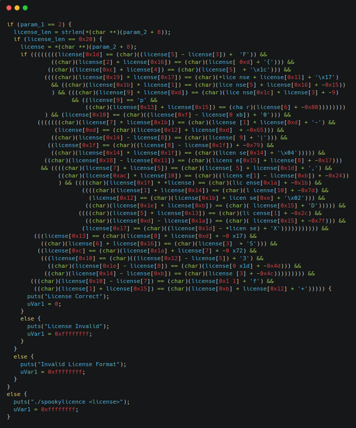

# Spookylicense

## Solution

By running the executable we can see that the program asks to input a license key. By running `strings`, `ltrace`, `strace` we cannot find any useful information. Opening the file with **Ghidra** we can see that in the main function the program performs a series of checks.



Now, there are two possibilities: we can either reverse the condition manually or we can use **angr** to solve the challenge automatically. We will use angr, which is a binary analysis tool that provides both static and dynamic analysis. In our case we will use the **symbolic execution** engine to solve the challenge.

We have to import **angr** and **claripy** which is its solver engine. 

```python
import angr
import claripy
```

We can create a project with the executable and create a symbolic variable for the flag which will be used later as the entry point for the symbolic execution.

```python
project = angr.Project('./spookylicense.out', load_options={'auto_load_libs' : False})

flag_length = 32 
flag_chars = claripy.BVS('flag', flag_length * 8)
```

To create the entry state we can use the function `entry_state` which take as argument the arguments of the program, and some options (in our case are not mandatory, but removes some warnings). 

```python
argv = [project.filename] + [flag_chars]

entry_state = project.factory.entry_state(
    args=argv,
    add_options={angr.sim_options.ZERO_FILL_UNCONSTRAINED_REGISTERS,angr.sim_options.ZERO_FILL_UNCONSTRAINED_MEMORY}
    )
```

To start the symbolic execution we can create a **simulation manager** which stores all the states of the program execution.

```python
sim_manager = project.factory.simulation_manager(entry_state)
```

The manager must know where to stop the execution, so we can provide an address to find (in our case is the address of the `puts` that says "License Correct" or where the string gets assigned to `rdi`) and we also must tell the program where we do not want to go (the address that terminates the program). 

```python
good_address = 0x400000 + 0x187d # 1876
avoid_address = 0x400000 + 0x1890 # 1889

sim_manager.explore(find=good_address, avoid=avoid_address)
```

Once the simulation has finished we can check if we found a possible solution and print it by getting a state that reached the `good_address` (found[0]) and then evaluate the symbolic variable to get a concrete string. 

```python
if sim_manager.found:
    print("gotten")
    solution = sim_manager.found[0].solver.eval(argv[1], cast_to=bytes)
    print(solution)
else:
    print("not gotten")
```

> **&#9432;** The full script can be found [here](./sol.py) with some additional comments.

## Sources

- Angr: [https://angr.io/](https://angr.io/)